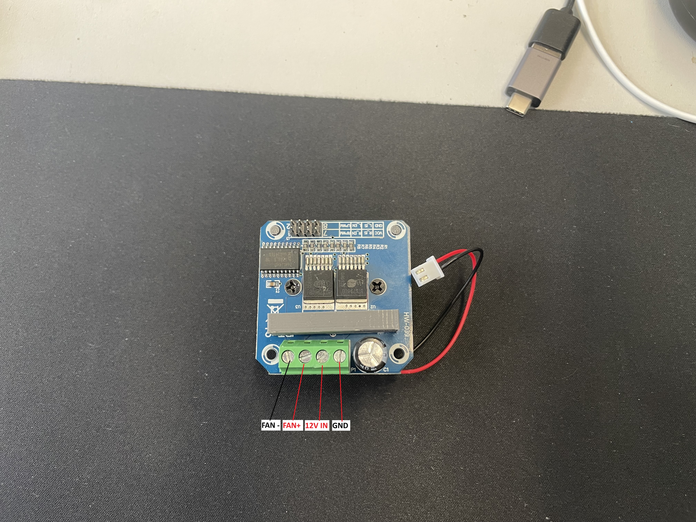
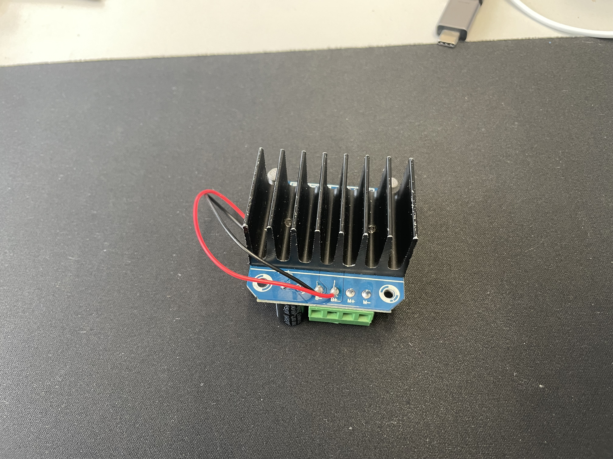
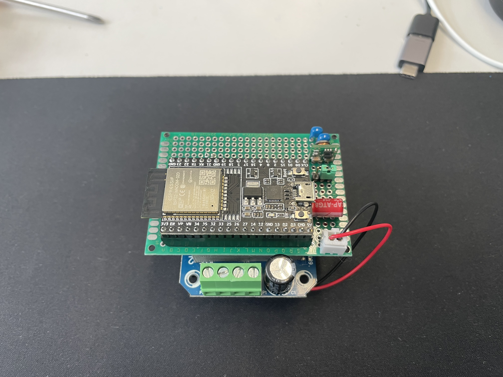
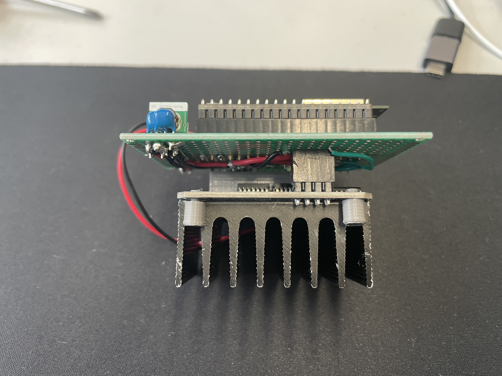
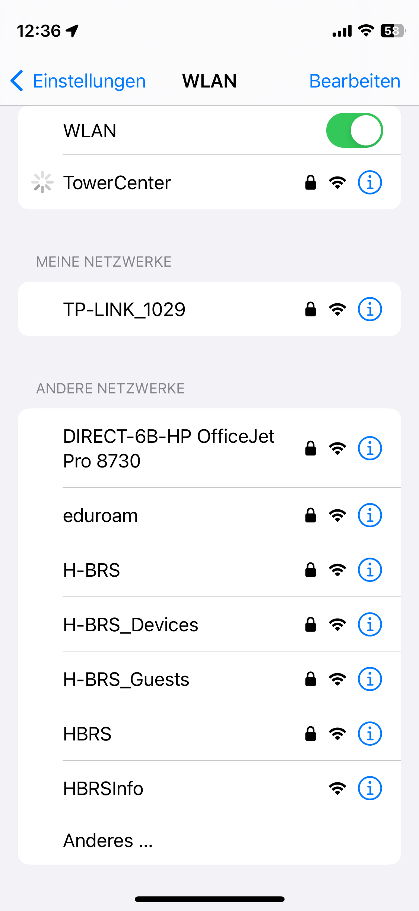
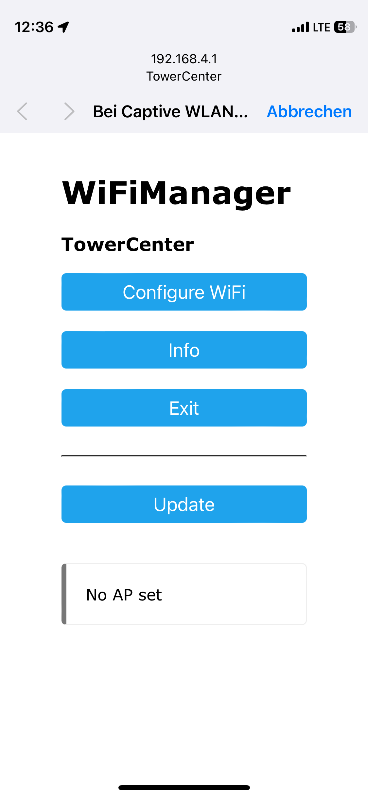
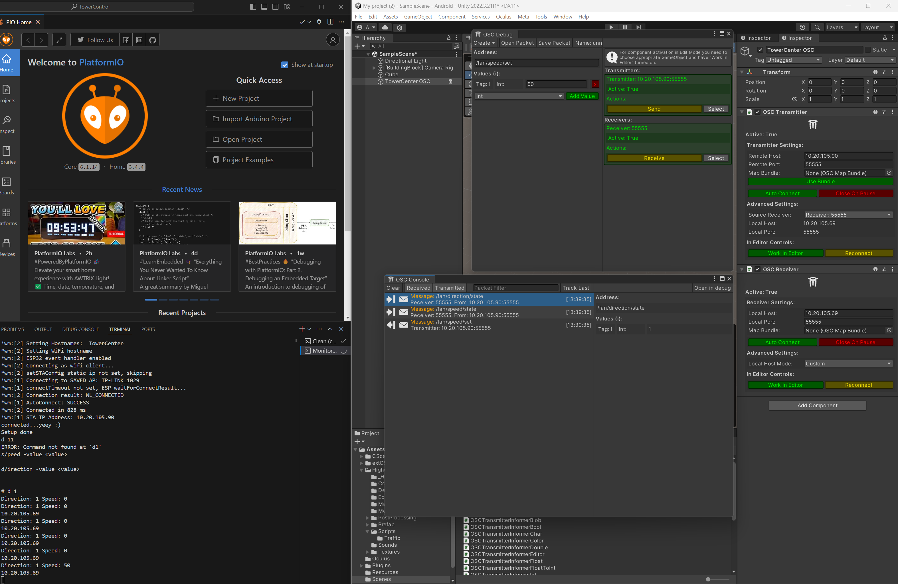

# Windy Towers
Code und Anleitung um die Ventilatoren der Türme zu steuern.

Jeder Ventilator erhält eine Steuereinheit bestehend aus einem Microcontroller (aktuell ESP32) und einer H-Brücke die hohe Ströme stand hält (BTS7960).
Die Microcontroller nehmen Befehle einer Anwendung entgegen und steuern den jeweiligen Ventilator an.

Die Microcrontroller können zurzeit mit einem WiFi verbunden und mit dem OSC-Protokoll angesprochen werden.

- [Windy Towers](#windy-towers)
  - [Development Setup](#development-setup)
  - [Build \& Deploy](#build--deploy)
  - [Hardware](#hardware)
    - [Host Board](#host-board)
    - [H-Bridge BTS7960](#h-bridge-bts7960)
    - [Assembly](#assembly)
  - [Usage](#usage)
    - [Serial](#serial)
    - [WiFi](#wifi)
      - [Connect to Wifi](#connect-to-wifi)
    - [OSC Endpoints](#osc-endpoints)
      - [Unity example](#unity-example)
    - [Bluetooth](#bluetooth)


## Development Setup
1. Clone Repository
2. Open directory with VS Code
3. Install PlatformIO
4. Optional: Install USB driver for microcontroller

## Build & Deploy
Each fan controller (left_board, right_board, center_board) requires another environment. See include/settings.h for more info.

1. Select the desired environment (ctrl+shift+p -> PlatformIO: Pick Project Environment)
2. Connect the Microcontroller via USB in Download/Flash Mode
3. Build & Upload (ctrl+shift+p -> PlatformIO: Build)

## Hardware

### Host Board
The Host board for the microcontroller converts 12V input voltage to 5V for the ESP32-board. Additionally it converts the 3.3V GPIO signal to 5V which is required by the h-bridge.
<p align="center">
    
    
</p>
Left: Top view. Host Board with mounting for an ESP32 Dev Kit. Level Shifter under the MIcrocontroller to convert 3.3V GPIO out to 5V required by the H-bridge. Power input and regulator on the right side to convert 12V input voltage to 5V to power the ESP32 power input.

Right: Bottom view. Mounting for the H-bridge. 

### H-Bridge BTS7960
Control the fans. Power connection for the host board soldered to the clamps for the input voltage
<p align="center">
    
    
</p>
Left: Top view. Connections from left to right: Output -, Output +, 12V Input, GND Input.

Right: Bottom view. Power Connector for the Host Board soldered to the input voltage pins.

### Assembly
Make sure to orient the microcontroller correct. Otherwise a shortage will ruin the board! If you control the Microcontroller via Serial console/USB make sure to __NOT__ power the microcontroller with the 12V input. To do so switch the jumper to the left configuration.

<p align="center">
    
    
</p>
Left: Top view. Jumper is in 12V configuration.

## Usage
Currently the fans can be controlled via WiFi/OSC or serial console. 

### Serial
Make sure that the jumper on the host board is in the 5V configuration.

Connect with a serial monitor and a baud rate of 9600.

You can control the board with
```
s/peed -value <value> (Value between 0 (0%) and 255 (100%))
s 50
speed 50

d/irection -value <value> (Value is 0 (STOP), 1 (LEFT), 2 (RIGHT))
d 0
direction 2
```


### WiFi
Each Microcontroller should be connected to a common WiFI. To do so the controllers open up a hotspot with their name (TowerCenter, TowerLeft, TowerCenter) if no WiFi is set up. 
You can force the controller to reset the wifi by pressing the reset button twice with a short pause between each press (EN on the ESP32 Dev Kit).

With a common WiFi the fan can be controlled via OSC.

#### Connect to Wifi
<p align="center">
    
    
</p>
Connect to the hotspot.
The WiFiManager should pop up where you can configure the wifi to connect to.

### OSC Endpoints
Default OSC port is 55555.

__/fan/speed/set__: Accepts a single int-Value between 0 and 255 (incl.) to set the speed of the fan in the current direction.

__/fan/direction/set__: Accepts a single int value between 0 and 2 (incl.) to set the direction of the fan.
  
- 0: STOPPED 
- 1: LEFT (Regular direction)
- 2: RIGHT (inverted direction)

__Response__:
The controllers respond with the current speed and direction on the endpoints __/fan/speed/state__ and __/fan/direction/state__

#### Unity example
Within Unity you can use [extOSC - Open Sound Control](https://assetstore.unity.com/packages/tools/input-management/extosc-open-sound-control-72005) to control the fans via OSC.


### Bluetooth
TODO: Not implemented.